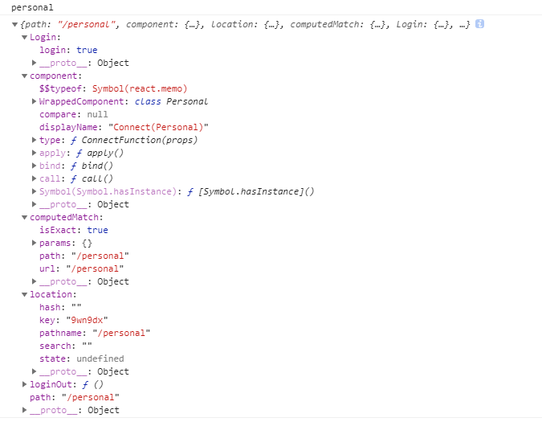
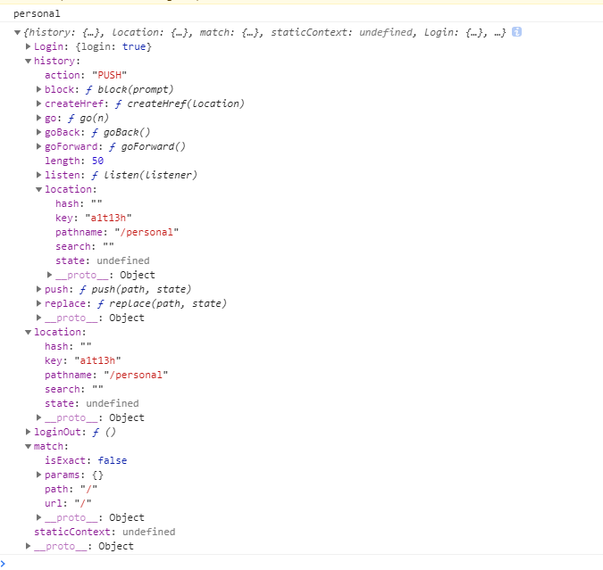

### react项目配置代理的步骤
#### 1.安装 http-proxy-middleware
在根目录下的命令行窗口输入: 
> npm install http-proxy-middleware --save
#### ps:1.5.若项目根目录下没有config文件，则先要输入下面这句命令，暴露出配置
> npm run eject
#### 2.在src目录下新建setupProxy.js文件
在setupProxy.js文件里输入:
```
const proxy = require("http-proxy-middleware");

module.exports = function(app) {
    app.use(
        proxy('/api', {
            target: "http://v.juhe.cn", //需要代理的地址
            changeOrigin: true,
            pathRewrite: {
                '^/api': ''
            }
        })
    );
}
```
#### 3.在/scripts/start.js文件里做一下配置， 找到 devServer ，然后加上 require('../src/setupProxy')(devServer);
```
 const devServer = new WebpackDevServer(compiler, serverConfig);
 require('../src/setupProxy')(devServer); // 新增此行代码
```

#### 4.在需要发送请求的地方使用 '/api' 代替需要代理的地址

参考链接：

### 问题一:用 http-proxy-middleware 配置代理，请求地址却报404错误
原因：在setupProxy.js少写了 pathRewrite 这个设置

### 问题二: 使用antd框架，按需引入出错

### react项目的路由拦截
验证路由的代码：
```
import React,{Component} from 'react';
import { connect } from 'react-redux';
import {Redirect,Route} from 'react-router-dom';
class AuthorizedRoute extends Component{

    constructor(props){
        super(props);
    }

    render(){
        let Component=this.props.component;
        console.log(this.props.login.login);
        return (
            <div>
                {this.props.login.login?<Component />:<Redirect to="/login"/>}    
            </div>
        )
    }
}

export default connect(state=>({login:state.login}),{})(AuthorizedRoute);
```


### 前端面试题一：
```
var name="world";
(function(){
    if(typeof name=="undefined"){
        var name="jack";
        console.log("Goodbye "+name);
    }else{
        console.log("Hello world");
    }
})()   //Goodbye jack，此题注意!!!

```
解释:使用立即执行函数的好处，通过定义一个匿名函数，创建了一个新的函数作用域，相当于创建了一个“私有”的命名空间，该命名空间的变量和方法，不会破坏污染全局的命名空间。此时若是想访问全局对象，将全局对象以参数形式传进去即可

### 前端面试题二：
```
var a=100;
function fn1(){
    alert(a);
    var a=10;
}
fn1(); //undefined,因为在函数里又重新声明了一个a变量，在还没赋值之前就调用了
alert(fn1()); //undefined,因为fn1函数没有返回值
```

var a=100;
function fn1(){
    alert(a);
    var a=10;
}
fn1();
alert(fn1());

### 其他面试题
1.undefined和null出现的情况
2.axios和fetch的区别
3.优化页面的scroll事件

### 知识点：路由拦截使用Route组件来写,详细见authorizedRoute.jsx文件
参考链接：https://www.cnblogs.com/kdcg/p/9309600.html
```
//此种写法正确
            <Route render={ props=>{
               return login?
               <Component {...props}/>:
               <Redirect to={{"pathname":"/login",state:{from:props.location}}}/>
            }}>          
            </Route>

            //此种写法亦正确,但在Component组件里，返回上一页的this.props.history.goBack();无法使用
            /*<div>
                {login?
                <Component {...this.props}/>:
                <Redirect to={{"pathname":"/login",state:{from:this.props.location}}}/>}
            </div>*/
```
下图为验证路由在已登录状态下没有重定向到login页面而是渲染Component，在Component页面里的this.props的比较图




### 知识点：利用路由重定向Redirect跳转另一个页面，用props是无法将地址链接传到另一个页面的
```
<Redirect to={{pathname:'/login',state:{from:props.location}}}>
```

### 知识点：dispatch action 后需要做操作可以传回调函数过去createAction那里
比如登录页面点击登录按钮要将登录信息更新到store里，之后就返回来的那个页面，详细代码看
.login.jsx
```
backFrom= ()=>{
        let fromPath = this.props.location.state.from.pathname; //获取from的路径
        this.props.history.push(fromPath); //路由跳转   
    }

<MyButton touch={this.props.loginIn.bind(this,this.backFrom)}>登录</MyButton>
export default connect(state=>state.login,{loginIn})(Login);    

```
action/login.js
```
export const loginIn = (callback) => {
    return dispatch => {
        setTimeout(() => {
            window.localStorage.setItem("login", true);
            dispatch({
                type: actions.LOGIN_IN
            });
            message.info('登录成功', 2);
            callback();
        }, 500)
    }
}
```

### 知识点：asnyc await，用await修饰的函数的返回值要是个promise才行

#### 知识点：路由的跳转
```
this.props.history.push(path);
```

#### 知识点：表单组件获取值
```
 enterCode=(event)=>{
    var text=event.target.value;
    console.log(text);
}

<textarea onInput={this.enterCode.bind(this)}>
</textarea>

```
#### 知识点：表单组件的双向数据绑定要用到onChange
```
codeChange(event){
        this.setState({
            value:event.target.value
        })
    }
<textarea 
    value={this.state.value} 
    onChange={this.codeChange.bind(this)}
    ></textarea>
```

### 知识点：封装用axios请求的get或post请求要返回用new Promise包裹的axios请求，然后调用这个封装方法才能用then来做后面的操作
```
export const get = (url, data) => {
    let param = ``;
    let newUrl = url;
    for (let key in data) {
        param += `${key}=${data[key]}&`
    }
    param += `key=${key}`;
    newUrl = newUrl + `?` + param;
    return new Promise((resolve, reject) => {
        axios.get(newUrl).then(res => {
            resolve(res);
        })
    })
}
```